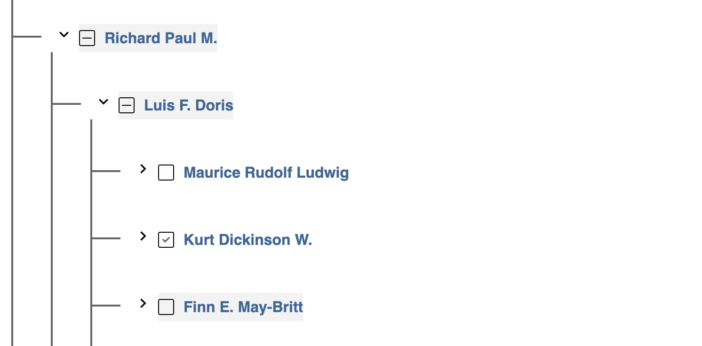

# Exemplo de renderização de uma árvore em react

Neste exemplo utilizei puramente typescript com react para implementar a lógica de renderuzação de uma árvore.

Fora utilizados apenas componentes funcionais e hooks para chegar no objetivo.

Foi criado os testes para o componente `<Tree />` utilizando algumas bibliotecas que existem no mercado. Para demonstração de conhecimento utilizei algumas bibliotecas que se equivalem e não precisem serem usadas juntas em um ambiente de desenvolvimento real.

Para cumprir com o bjetivo também adicionei uma camada de persistencia no `local storage` para que possa se manter os nós já selecionados pelo usuário mesmo após um `refresh` na página

Bibliotecas utlizadas:
- React icons
- styled-components
- enzime
- react-test-renderer
- jest
- testing-library/react
- testing-library/jest-dom
- testing-library/user-event



# Instalação do projeto
1. clone o projeto com o git:
    ```zsh
    git clone https://github.com/xpiral14/react-treee
    ```

2. Acesse a pasta do projeto e instale as dependências utilizando `yarn` ou `npm`

    ```zsh
    cd react-treee & yarn
    ```
    ou
    ````zsh
    cd react-treee & npm install

3. Inicie o projeto
    ```zsh
    yarn start
    ```
    ou 
    ```zsh
    npm run start
    ```